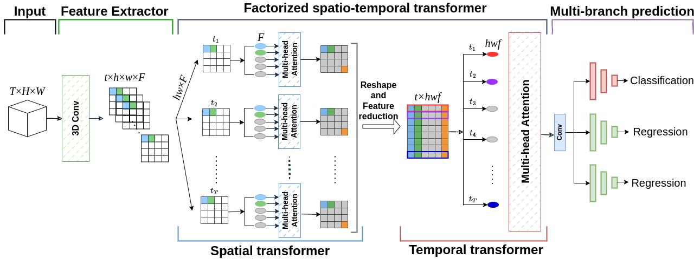

<div align="center">

# A Hybrid Convolutional-Transformer Model for FFR and iFR Assessment from Angiography Data
R. Mineo, F. Proietto Salanitri, G. Bellitto, I. Kavasidis, O. De Filippo, M. Millesimo, G. M. De Ferrari, M. Aldinucci, D. Giordano, S. Palazzo, F. D'Ascenzo and C. Spampinato

<!---[]()-->
[](https://ieeexplore.ieee.org/abstract/document/10582501)
</div>

# Overview
Official PyTorch implementation of paper: <b>"A Convolutional-Transformer Model for FFR and iFR Assessment From Coronary Angiography"</b>

# Abstract
The quantification of stenosis severity from X-ray catheter angiography is a challenging task. Indeed, this requires to fully understand the lesion’s geometry by analyzing dynamics of the contrast material, only relying on visual observation by clinicians. To support decision making for cardiac intervention, we propose a hybrid CNN-Transformer model for the assessment of angiography-based non-invasive fractional flow-reserve (FFR) and instantaneous wave-free ratio (iFR) of intermediate coronary stenosis. Our approach predicts whether a coronary artery stenosis is hemodynamically significant and provides direct FFR and iFR estimates. This is achieved through a combination of regression and classification branches that forces the model to focus on the cut-off region of FFR (around 0.8 FFR value), which is highly critical for decision-making. We also propose a spatio-temporal factorization mechanisms that redesigns the transformer’s self-attention mechanism to capture both local spatial and temporal interactions between vessel geometry, blood flow dynamics, and lesion morphology. The proposed method achieves state-of-the-art performance on a dataset of 778 exams from 389 patients. Unlike existing methods, our approach employs a single angiography view and does not require knowledge of the key frame; supervision at training time is provided by a classification loss (based on a threshold of the FFR/iFR values) and a regression loss for direct estimation. Finally, the analysis of model interpretability and calibration shows that, in spite of the complexity of angiographic imaging data, our method can robustly identify the location of the stenosis and correlate prediction uncertainty to the provided output scores.

# Method
 <p align = "center"></p>
Architecture of the proposed approach for stenosis significance assessment. Input angiography videos are first processed by a pre-trained 3D convolutional model for local feature extraction. Then, self-attention layers based on transformers are employed to capture intra-relations in space and time, and the resulting intermediate representation is fed to three output branches, providing predictions as either a significance class or a regression estimate of FFR/iFR values.

# Interpretability of results
Interpretability maps, computed by M3D-cam, of our method (last row) and other state-of-the-art approaches. The red bounding box highlights the location of the major stenosis as identified by cardiologists. 

<p align = "center"></p>

# How to run
The code expects a JSON file in the format support by MONAI, passed via the `--split_path` argument, with the following structure:
```
{
 "num_fold": <N>, 
 "fold0": { "train": [ {"image": <path>,
                        "label": <class>,
                        "FFR": <value>,
                        "iFR": <value>},
                       ...
                       {"image": <path>,
                        "label": <class>,
                        "FFR": <value>,
                        "iFR": <value>}
                      ],
            "val": [ {"image": <path>,
                        "label": <class>,
                        "FFR": <value>,
                        "iFR": <value>},
                      ...],
            "test": [{"image": <path>,
                        "label": <class>,
                        "FFR": <value>,
                        "iFR": <value>},
                      ...]}, 
 "fold1": { "train": [...],
            "val": [...],
            "test": [...]},
 ...
}
```
`<N>`, `<path>`, `<class>` and `<value>` fields should be filled as appropriate.
Each path should point to a `.npy`file containing a 3D (2D+T) tensor, representing an angiography video.

## Pre-requisites:
- NVIDIA GPU (Tested on Nvidia Tesla T4 GPUs )
- [Requirements](requirements.txt)

## Train Example
 To start training, simply run (using default arguments):
 
 ```python train.py --root_dir='<dataset_path>' --split_path='<split_json_path>'```
 
To start distributed training, use:

```
python -m torch.distributed.launch --nproc_per_node=<N_GPUS> --use_env train.py --root_dir='<dataset_path>' --split_path='<split_json_path>'
```

## Test Example
To start evaluation, simply run (using default arguments):

```python test.py --logdir='<log_path>' --start_tornado_server=1 --enable_explainability=1```

Log directories are automatically created upon training inside a `logs` directory.

To start distributed testing, use:

```
python -m torch.distributed.launch --nproc_per_node=<N_GPUS> --use_env test.py --logdir='<log_path>' --start_tornado_server=1 --enable_explainability=1
```

<!--- ## Notes --->
<!--# Acknowledgements
This code is taken from https://github.com/IngRaffaeleMineo/3D-BCPTcode and modified to our purposes.-->
